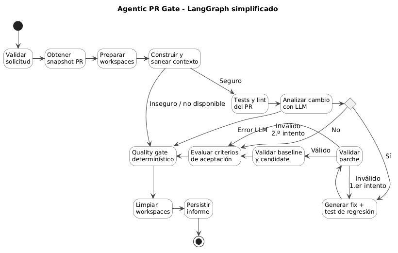

# Agentic PR Gate

Prototipo para decidir de forma trazable la transición **Pull Request -> QA**.
El LLM propone hallazgos y parches estructurados; las herramientas y la política
determinística aportan evidencia y emiten `READY`, `CONDITIONAL`, `BLOCKED` o
`INCONCLUSIVE`. No hace push, merge, reviews ni comentarios en GitHub.

## Requisitos

- **Docker con Docker Compose y el daemon de Docker corriendo.** Es el único
  requisito para usar el prototipo: la validación del código del PR se ejecuta
  en contenedores efímeros creados por el propio servicio, por lo que Docker
  debe estar activo antes de arrancar. Verifíquelo con `docker info`.
- Para ejecutar análisis reales, copiá `.env.example` a `.env` y configurá al
  menos una credencial de LLM: `GEMINI_API_KEY` o `OPENAI_API_KEY`.
- `GITHUB_TOKEN` es opcional y ayuda con repositorios privados o límites de API.

## Uso

```bash
docker compose up --build
```

Un solo comando. Cuando termine la construcción, abra `http://localhost:5173`,
pegue la URL de un pull request de GitHub
(`https://github.com/{owner}/{repo}/pull/{number}`), seleccione el perfil de
modelo y el de validación, y siga el progreso hasta el informe. Gemini aparece
como opción por defecto. La única forma de probar el prototipo es con una URL
de PR de GitHub.

En el primer arranque la base SQLite se crea vacía y se migra automáticamente;
no hay pasos de instalación ni de migración manual. El volumen `pr-gate-data`
conserva los informes entre reinicios. Para volver a una base vacía (por
ejemplo, antes de una demo):

```bash
docker compose down -v
```

Atención: ese comando destruye el volumen y, por tanto, todos los informes
persistidos.

### Claves (opcional)

```bash
cp .env.example .env
# edite .env y complete GEMINI_API_KEY, OPENAI_API_KEY y/o GITHUB_TOKEN
docker compose up --build
```

Las claves se leen únicamente del entorno; nunca se guardan en SQLite, YAML,
logs ni respuestas HTTP.

## Flujo LangGraph

El diagrama resume el flujo principal del análisis: validar la solicitud,
obtener el snapshot del PR, preparar workspaces, construir y sanear el contexto,
analizar con LLM, validar baseline y candidate, aplicar el quality gate y
persistir el informe.



## Qué entrega un análisis

El informe explica la decisión, no solo el estado final. Incluye la trazabilidad
del PR y SHA analizado, hallazgos con evidencia, corrección y test propuestos
cuando aplican, resultados de validación, reglas del gate, controles omitidos y
acciones necesarias para avanzar.

Los secretos nunca se muestran: el informe solo conserva evidencia segura como
archivo, línea y tipo de patrón. Cuando el LLM o el runner no se ejecutan, el
informe indica la causa; en ese caso no presenta tokens o costo como disponibles.
