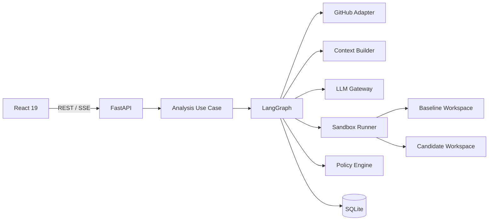
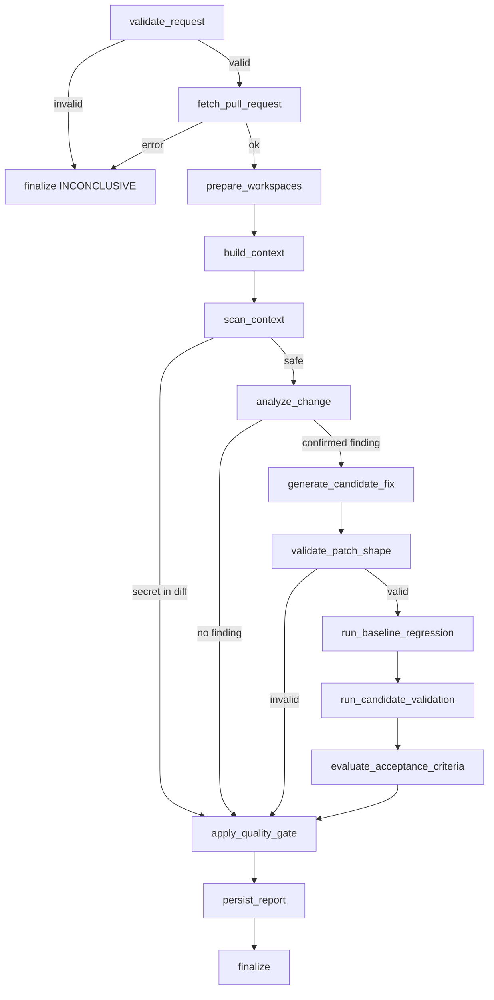

# plan.md

## 1. Estrategia

Construir el sistema de afuera hacia adentro, con una vertical slice temprana:

1. recibir una URL de PR;
2. simular GitHub y LLM;
3. recorrer LangGraph;
4. persistir una decisión;
5. mostrarla en React;
6. reemplazar adaptadores simulados por GitHub, LLM y runner reales;
7. endurecer seguridad;
8. preparar demo y documentación.

El núcleo no debe depender de que la interfaz esté terminada ni de un proveedor LLM concreto.

---

## 2. Arquitectura



### Principio central

```text
LLM = hipótesis y propuesta
Herramientas = evidencia
Policy engine = decisión
Persona = autoridad final
```

---

## 3. Estructura del repositorio

```text
.
├── AGENTS.md
├── spec.md
├── plan.md
├── tasks.md
├── README.md
├── docker-compose.yml
├── .env.example
├── backend/
│   ├── pyproject.toml
│   ├── alembic.ini
│   ├── migrations/
│   ├── src/
│   │   └── pr_gate/
│   │       ├── main.py
│   │       ├── api/
│   │       │   ├── dependencies.py
│   │       │   ├── errors.py
│   │       │   ├── schemas.py
│   │       │   └── routes/
│   │       ├── domain/
│   │       │   ├── analysis.py
│   │       │   ├── findings.py
│   │       │   ├── gate.py
│   │       │   ├── pull_request.py
│   │       │   └── validation.py
│   │       ├── application/
│   │       │   ├── ports/
│   │       │   ├── services/
│   │       │   └── use_cases/
│   │       ├── graph/
│   │       │   ├── state.py
│   │       │   ├── builder.py
│   │       │   ├── routing.py
│   │       │   └── nodes/
│   │       ├── infrastructure/
│   │       │   ├── config/
│   │       │   ├── database/
│   │       │   ├── github/
│   │       │   ├── llm/
│   │       │   ├── runner/
│   │       │   └── security/
│   │       └── observability/
│   └── tests/
│       ├── unit/
│       ├── integration/
│       └── contract/
├── frontend/
│   ├── package.json
│   ├── vite.config.ts
│   ├── src/
│   │   ├── app/
│   │   ├── api/
│   │   ├── components/
│   │   ├── features/
│   │   │   ├── analyses/
│   │   │   ├── reports/
│   │   │   └── settings/
│   │   ├── pages/
│   │   └── types/
│   └── tests/
├── config/
│   ├── models.example.yaml
│   ├── policies/
│   │   └── qa-gate-v1.yaml
│   └── validation-profiles.yaml
├── examples/
│   └── demo_ecommerce/
├── docs/
│   ├── architecture.md
│   ├── security.md
│   ├── demo.md
│   ├── decisions/
│   └── challenge-decision-document.md
└── scripts/
    ├── create_demo_prs.md
    └── run_demo.sh
```

---

## 4. Dominio

### 4.1 Entidades

- `PullRequestRef`
- `PullRequestSnapshot`
- `AnalysisRun`
- `Finding`
- `CandidateFix`
- `ValidationResult`
- `AcceptanceCriterion`
- `AcceptanceEvaluation`
- `GateRuleResult`
- `GateDecision`

### 4.2 Value objects

- `GitHubPullRequestUrl`
- `CommitSha`
- `FilePath`
- `ModelProfileId`
- `PolicyVersion`
- `PromptVersion`
- `Severity`
- `DecisionStatus`

### 4.3 Servicios puros

- `evaluate_quality_gate`
- `classify_validation_result`
- `validate_patch_paths`
- `determine_regression_reproduction`

Ningún servicio puro importa FastAPI, SQLAlchemy, HTTPX o SDKs de modelos.

---

## 5. Puertos de aplicación

Definir protocolos:

```python
class PullRequestProvider(Protocol):
    async def fetch_snapshot(self, ref: PullRequestRef) -> PullRequestSnapshot: ...
    async def download_archive(self, snapshot: PullRequestSnapshot, target: Path) -> None: ...

class LLMGateway(Protocol):
    async def analyze_change(self, request: AnalysisPrompt) -> AnalysisOutput: ...
    async def propose_fix(self, request: FixPrompt) -> FixOutput: ...

class SandboxRunner(Protocol):
    async def run(self, request: ValidationRequest) -> ValidationResult: ...

class AnalysisRepository(Protocol):
    async def create(self, run: AnalysisRun) -> None: ...
    async def save_finding(self, finding: Finding) -> None: ...
    async def save_decision(self, decision: GateDecision) -> None: ...

class EventPublisher(Protocol):
    async def publish(self, event: RunEvent) -> None: ...
```

Esto permite probar el grafo con adaptadores fake.

---

## 6. Estado de LangGraph

Usar un estado tipado y serializable.

```python
class AnalysisState(TypedDict, total=False):
    analysis_id: str
    request: AnalysisRequestData
    pr_snapshot: PullRequestSnapshotData
    baseline_workspace: str
    candidate_workspace: str
    context_bundle: ContextBundleData
    secret_scan: SecretScanData
    analysis_output: AnalysisOutputData
    candidate_fix: CandidateFixData
    baseline_validation: ValidationSummaryData
    candidate_validation: ValidationSummaryData
    acceptance_results: list[AcceptanceEvaluationData]
    gate_decision: GateDecisionData
    events: Annotated[list[RunEventData], operator.add]
    errors: Annotated[list[WorkflowErrorData], operator.add]
```

No guardar objetos no serializables, clientes HTTP, sesiones de DB ni SDKs dentro del estado.

---

## 7. Nodos de LangGraph

### 7.1 `validate_request`

- parsear URL;
- validar perfiles;
- validar criterios;
- crear `analysis_id`;
- persistir estado `PENDING`.

Ruta de error: `finalize_inconclusive`.

### 7.2 `fetch_pull_request`

- consultar GitHub;
- recuperar snapshot;
- comprobar estado;
- registrar `base_sha` y `head_sha`;
- aplicar límites preliminares.

### 7.3 `prepare_workspaces`

- descargar archive por SHA o clonar de forma controlada;
- crear baseline y candidate;
- filtrar paths;
- no ejecutar hooks;
- no inicializar submódulos.

### 7.4 `build_context`

Seleccionar:

1. diff;
2. archivos modificados;
3. imports locales directos;
4. tests relacionados;
5. documentación inmediata;
6. criterios de aceptación.

Aplicar presupuesto por prioridad y tokens aproximados.

### 7.5 `scan_context`

- detectar secretos;
- redactar valores;
- marcar archivos excluidos;
- bloquear cuando exista un secreto en el diff;
- no enviar contenido sensible al LLM.

### 7.6 `analyze_change`

Solicitar salida estructurada.

Temperatura por defecto: 0.

Si no hay hallazgo suficientemente respaldado:

- guardar resultado;
- continuar al gate con `no_confirmed_finding`;
- no fabricar una corrección.

### 7.7 `generate_candidate_fix`

Seleccionar el hallazgo principal:

1. critical;
2. high;
3. medium;
4. mayor confianza y mejor evidencia.

Generar un único parche acotado y un test de regresión.

### 7.8 `validate_patch_shape`

Validar:

- formato;
- paths;
- tamaño;
- ausencia de binarios;
- ausencia de archivos protegidos;
- ausencia de comandos;
- aplicación limpia.

### 7.9 `run_baseline_regression`

Aplicar solo el parche del test al baseline.

Ejecutar el test dirigido.

Clasificar:

- `REPRODUCED`;
- `NOT_REPRODUCED`;
- `INFRASTRUCTURE_ERROR`;
- `INVALID_TEST`.

El test solo reproduce si falla por la aserción funcional esperada.

### 7.10 `run_candidate_validation`

Aplicar código + test al candidate.

Ejecutar:

1. test dirigido;
2. suite;
3. lint;
4. secret scan posterior.

### 7.11 `evaluate_acceptance_criteria`

Combinar:

- evidencia de tests;
- código;
- análisis estructurado;
- checks.

El LLM puede mapear evidencia a criterios, pero cada resultado debe citar evidencia.

### 7.12 `apply_quality_gate`

Función pura. No llamar al LLM.

### 7.13 `persist_report`

Persistir todas las entidades en una transacción lógica.

### 7.14 `finalize`

- emitir evento final;
- limpiar workspaces;
- cerrar estado;
- conservar únicamente artefactos permitidos.

---

## 8. Rutas condicionales



---

## 9. GitHub

### 9.1 Cliente

Usar HTTPX contra GitHub REST API para mantener control de:

- headers;
- timeouts;
- versionado;
- rate limit;
- errores;
- retries;
- testabilidad.

Endpoints requeridos:

- get PR;
- list PR files;
- list commits;
- obtener checks para head SHA;
- descargar archive o contenido por SHA cuando corresponda.

### 9.2 Autorización

- `GITHUB_TOKEN` opcional para públicos;
- requerido para privados;
- permisos de lectura;
- redactado en logs.

### 9.3 Integridad

- paginar archivos;
- registrar si GitHub truncó patches;
- recuperar diff completo cuando sea necesario;
- rechazar análisis parcial no declarado;
- comprobar nuevamente head SHA antes del gate.

---

## 10. Proveedor LLM configurable

### 10.1 Decisión

La aplicación tendrá una interfaz propia y un adaptador de gateway multi-proveedor.

Implementación inicial recomendada:

- un adaptador basado en LiteLLM o una interfaz OpenAI-compatible para cobertura amplia;
- tests contractuales con un fake;
- al menos dos perfiles reales documentados si existen credenciales, por ejemplo OpenAI y Gemini/Anthropic;
- posibilidad de añadir un adaptador directo sin modificar el grafo.

No prometer “todos los proveedores”; prometer “proveedores configurables mediante adaptadores y perfiles”.

### 10.2 Configuración

```yaml
models:
  - id: openai-small
    adapter: litellm
    model: openai/model-name
    api_key_env: OPENAI_API_KEY
    enabled: true
  - id: google-fast
    adapter: litellm
    model: gemini/model-name
    api_key_env: GEMINI_API_KEY
    enabled: true
```

El loader valida que:

- el ID sea único;
- exista la variable esperada;
- la temperatura esté permitida;
- los timeouts sean razonables.

### 10.3 Prompts

Versionar:

```text
backend/src/pr_gate/infrastructure/llm/prompts/
├── analyze_change_v1.md
└── propose_fix_v1.md
```

Separar:

- instrucciones;
- contexto;
- esquema;
- criterios;
- restricciones.

No mezclar políticas del gate dentro del prompt.

---

## 11. Context builder

### 11.1 Priorización

1. Líneas del diff.
2. Archivo completo si es pequeño.
3. Símbolos contenedores.
4. Imports locales.
5. Tests relacionados.
6. Archivos de dominio.
7. Documentación.

### 11.2 Presupuesto

Configurar:

- máximo de archivos;
- máximo de caracteres;
- máximo por archivo;
- máximo estimado de tokens.

Registrar qué se incluyó y excluyó.

### 11.3 Localización

Agregar números de línea estables y SHA de contenido para poder citar evidencia.

---

## 12. Parche y test

### 12.1 Formato

Solicitar unified diff.

Separar:

- `source_patch`;
- `regression_test_patch`.

### 12.2 Aplicación

Usar `git apply --check` y luego `git apply` dentro del workspace.

Nunca aplicar al checkout original.

### 12.3 Validación semántica del test

La reproducción debe distinguir:

- assertion failure esperada;
- syntax error;
- import error;
- timeout;
- dependencia faltante;
- error del runner.

Para la demo, el test generado puede incluir una marca conocida en el nombre para ejecutar el test dirigido.

---

## 13. Runner aislado

### 13.1 MVP

Contenedor efímero por fase.

Restricciones:

- `--network none`;
- memoria limitada;
- CPU limitada;
- PID limit;
- timeout externo;
- usuario no root;
- mounts mínimos;
- sin variables sensibles;
- working directory temporal.

### 13.2 Perfiles

El perfil define comandos y paths. No leer comandos desde el PR.

### 13.3 Salida

Capturar y limitar:

- stdout;
- stderr;
- exit code;
- duración;
- timeout;
- fase;
- hash del workspace;
- nombre del comando.

---

## 14. Motor de políticas

### 14.1 Modelo

```python
@dataclass(frozen=True)
class GateFacts:
    head_sha_current: bool | None
    context_complete: bool
    tests_executed: bool
    tests_passed: bool | None
    critical_findings: int
    secrets_detected: bool
    required_criteria_evaluated: bool
    required_criteria_passed: bool | None
    patch_applied: bool | None
    regression_reproduced: bool | None
    regression_fixed: bool | None
    business_logic_changed: bool
    tests_changed: bool
    pr_is_draft: bool
```

### 14.2 Evaluación

- Cada regla devuelve `PASS`, `FAIL` o `UNKNOWN`.
- La decisión agrega resultados.
- `UNKNOWN` en regla obligatoria produce `INCONCLUSIVE`.
- No derivar la decisión de texto del LLM.

### 14.3 Versionado

Cargar `qa-gate-v1.yaml`, validar el schema y guardar checksum.

---

## 15. SQLite

### 15.1 Implementación

- SQLAlchemy 2 async si no agrega complejidad excesiva; en caso contrario, sync con sesiones cortas y claras.
- Alembic.
- foreign keys activadas;
- índices por PR, SHA, fecha y decisión;
- transacciones;
- JSON serializado de manera explícita.

### 15.2 Retención

Para el prototipo:

- conservar metadatos, extractos, parches y reportes;
- borrar workspaces al finalizar;
- permitir comando administrativo para limpiar análisis antiguos.

---

## 16. API y ejecución asíncrona

### 16.1 MVP

Al crear análisis:

1. persistir `PENDING`;
2. iniciar una tarea administrada en proceso;
3. devolver `202`.

Para robustez mayor:

- una cola sería preferible;
- queda fuera del MVP.

Documentar que las tareas en proceso no sobreviven a un reinicio inesperado. Al iniciar la app, marcar ejecuciones huérfanas como `FAILED` o `INCONCLUSIVE`.

### 16.2 Streaming

SSE basado en `run_events`.

Si SSE falla, frontend consulta `GET /analyses/{id}` periódicamente.

---

## 17. Frontend

### 17.1 Estado remoto

Usar TanStack Query para:

- perfiles;
- creación;
- informe;
- historial;
- polling fallback.

### 17.2 Rutas

- `/` nuevo análisis;
- `/analyses` historial;
- `/analyses/:id` progreso/informe;
- `/about` alcance y limitaciones.

### 17.3 Componentes principales

- `PullRequestForm`
- `ModelProfileSelect`
- `AcceptanceCriteriaEditor`
- `AnalysisProgress`
- `GateDecisionBanner`
- `FindingCard`
- `PatchViewer`
- `ValidationComparison`
- `CriteriaTable`
- `PolicyResults`
- `RunMetrics`
- `LimitationsPanel`

### 17.4 Diff

Usar un visor de texto seguro. Si se agrega una librería, evaluar tamaño y mantenimiento. El MVP puede mostrar diff monoespaciado escapado.

---

## 18. Demo e-commerce

### 18.1 Base

FastAPI o dominio Python pequeño dentro de `examples/demo_ecommerce`.

### 18.2 Cambio defectuoso

La rama/PR modifica el servicio para usar precio del request.

### 18.3 Corrección esperada

- buscar producto;
- validar existencia;
- usar `product.price`;
- validar cantidad;
- devolver líneas normalizadas.

### 18.4 Test esperado

Enviar `unit_price=1` para producto de `100`, cantidad `2`; esperar total `200`.

### 18.5 PRs

Preparar:

- PR A: inseguro, resultado esperado `BLOCKED`;
- PR B: seguro, resultado esperado `READY`;
- caso C: runner incompleto, resultado esperado `INCONCLUSIVE`.

---

## 19. Seguridad

Crear threat model mínimo:

| Riesgo | Mitigación |
|---|---|
| PR con código malicioso | sandbox sin red, límites, no root |
| Prompt injection dentro del código | tratar contenido como datos, herramientas cerradas |
| Exfiltración de secretos | escaneo, redacción, no montar secrets |
| Comando arbitrario | allowlist administrada |
| Path traversal en parche | normalización y validación |
| PR cambia durante análisis | fijar SHA y verificar al final |
| Logs con código sensible | extractos mínimos y redacción |
| Token GitHub con exceso | scope de solo lectura |
| Output LLM inválido | Pydantic y límite de reintentos |
| Dependencia comprometida | lockfiles, pinning y escaneo |

---

## 20. Observabilidad

### Logs

JSON con:

- timestamp;
- level;
- analysis_id;
- node;
- event;
- duration;
- error_code.

No registrar prompts completos por defecto.

### Métricas

- ejecuciones por estado;
- duración por nodo;
- fallos GitHub;
- fallos LLM;
- output inválido;
- tokens;
- costo estimado;
- patch apply success;
- regression reproduction success;
- decisiones.

Para el MVP pueden exponerse en el informe y logs; Prometheus es opcional.

---

## 21. Estrategia de tests

### Pirámide

1. Muchas pruebas unitarias:
   - gate;
   - URL;
   - patch paths;
   - clasificación de test;
   - modelos.
2. Integración:
   - SQLite;
   - GitHub mock;
   - LLM fake;
   - runner controlado;
   - grafo completo fake.
3. E2E:
   - backend + frontend con análisis fake;
   - demo real manual y automatización parcial.

### Casos críticos

- output LLM inválido;
- patch fuera de scope;
- timeout;
- test falla por import;
- test reproduce correctamente;
- suite falla luego del parche;
- PR actualizado;
- secreto detectado;
- GitHub rate limit;
- regla obligatoria unknown;
- historial tras reinicio.

---

## 22. Fases de implementación

### Fase 0 — Bootstrap

Monorepo, tooling, CI y documentación base.

### Fase 1 — Dominio y persistencia

Entidades, gate puro, SQLite y migraciones.

### Fase 2 — Vertical slice fake

API + LangGraph fake + UI + historial.

### Fase 3 — GitHub real

Ingesta completa y snapshot por SHA.

### Fase 4 — LLM real

Abstracción, perfiles, prompts y outputs estructurados.

### Fase 5 — Parches y runner

Workspaces, patch validation y sandbox.

### Fase 6 — Gate completo

Criterios, reglas, evidencia y estados.

### Fase 7 — Demo

PRs, métricas, documentación y ensayo.

---

## 23. Decisiones explícitas

### ADR-001 — Workflow dirigido con LangGraph

Se usa LangGraph para representar estado, ramas, persistencia de progreso y observabilidad. No se usa un agente autónomo porque el proceso debe ser previsible.

### ADR-002 — Quality gate determinístico

El LLM no devuelve READY/BLOCKED como fuente de verdad.

### ADR-003 — GitHub de solo lectura

Reduce riesgo y mantiene el prototipo enfocado.

### ADR-004 — SQLite

Suficiente para una aplicación mono-instancia y fácil de reproducir.

### ADR-005 — Modelo configurable por perfiles

Las credenciales y capacidades permanecen del lado servidor.

### ADR-006 — Docker sandbox

Es necesario porque se ejecuta código proveniente de PRs.

### ADR-007 — Dos workspaces

Permite demostrar fail-before/pass-after sin contaminar el repositorio.

### ADR-008 — Monorepo con demo

Facilita entrega, reproducción y apertura de PRs de demostración.

---

## 24. Riesgos de implementación

### Riesgo: generar tests que fallan por razones equivocadas

Mitigación: clasificador de resultados y casos de demo acotados.

### Riesgo: patches truncados de GitHub

Mitigación: recuperar snapshot y generar diff local por SHA.

### Riesgo: demasiada complejidad en sandbox

Mitigación: un solo perfil Python para la demo.

### Riesgo: proveedor LLM no soporta structured output

Mitigación: gateway que solicite JSON y valide Pydantic; adaptadores pueden usar capacidades nativas cuando existan.

### Riesgo: latencia alta

Mitigación: contexto acotado, dos llamadas LLM principales, modelo económico y cache por SHA/model/prompt.

### Riesgo: costo impredecible

Mitigación: límites de contexto, usage, perfiles y presupuesto.

### Riesgo: OpenCode expande el alcance

Mitigación: respetar `spec.md` y `tasks.md`; todo extra va a backlog.

---

## 25. Secuencia de demo

1. Mostrar política del gate.
2. Pegar URL del PR defectuoso.
3. Seleccionar modelo.
4. Iniciar análisis.
5. Mostrar diff y hallazgo.
6. Mostrar test que falla en baseline.
7. Mostrar patch.
8. Mostrar test y suite que pasan en candidate.
9. Mostrar decisión y evidencia.
10. Repetir con PR seguro o mostrar informe guardado.
11. Mostrar caso `INCONCLUSIVE`.
12. Cerrar con costo, privacidad, limitaciones y siguientes pasos.

---

## 26. Referencias técnicas oficiales

Consultar documentación oficial y versiones vigentes durante la implementación:

- LangGraph Graph API: https://docs.langchain.com/oss/python/langgraph/graph-api
- LangGraph testing: https://docs.langchain.com/oss/python/langgraph/test
- GitHub REST Pull Requests: https://docs.github.com/en/rest/pulls/pulls
- GitHub REST API: https://docs.github.com/en/rest
- React: https://react.dev/
- React TypeScript: https://react.dev/learn/typescript
- LiteLLM providers, si se adopta ese adaptador: https://docs.litellm.ai/docs/providers

No copiar APIs de ejemplos desactualizados sin verificarlas contra la versión fijada.
